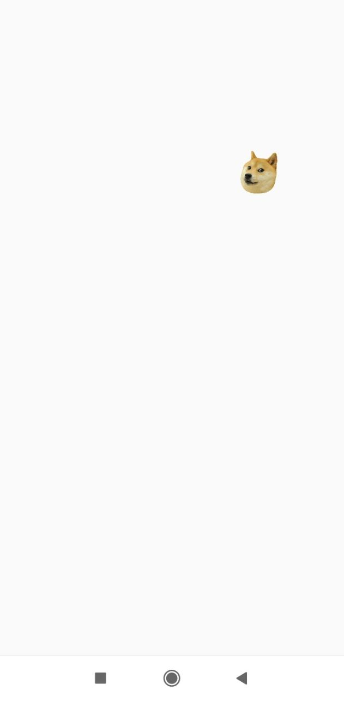

# Doge-Accelerometer
A simple Accelerometer app with moving doge.
Application that is using Android's accelerometer sensor to move the image across the screen. Rotate the phone to control the movement of the doge.\
This app is a simple project for Mobile Computing course.

